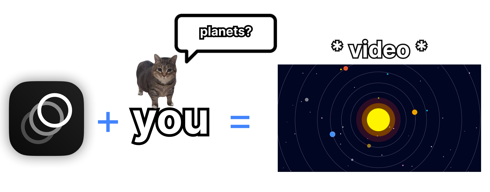

  
  <h1 align="center">✨🪐 Animo ⚛️🩶</h1>

  

Welcome to **Animo ❤️**, an easy way to make cool videos from text.

So you maybe have used someday editors like **VSCode**, **Cursor**, **Windsurf**, or **Kiro**?

If yes, keep reading...

OK. So **Animo** is a **free extension** for them.  

Just open your editor, search for **Animo**, and install it — that’s it! 🥹

Next time you talk to the AI from your editor, just tell it:  
> “Create a solar system”

…and boom! there you have it.

It generates the video of it at the left side of your editor.

